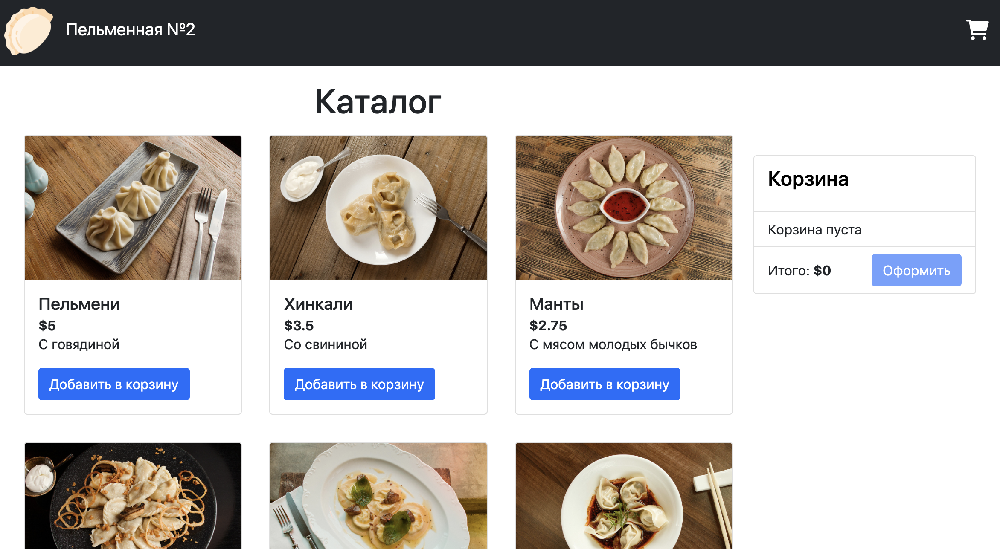
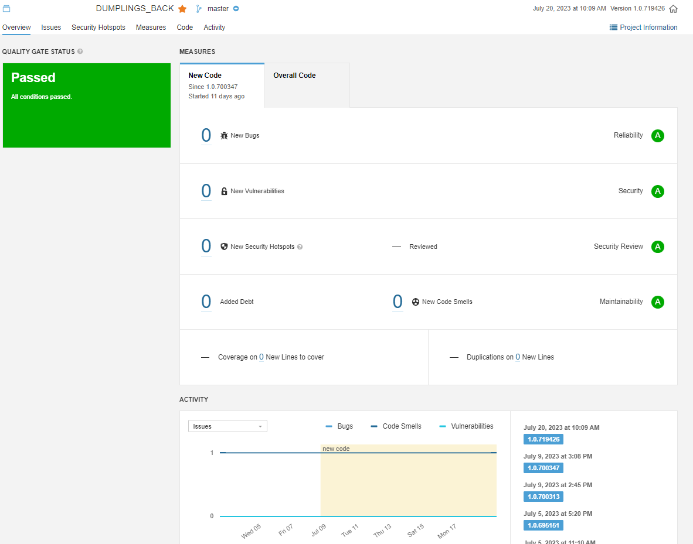
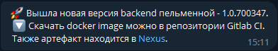
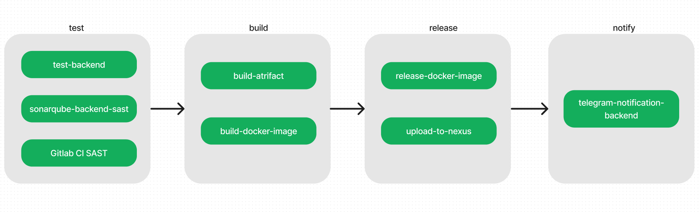
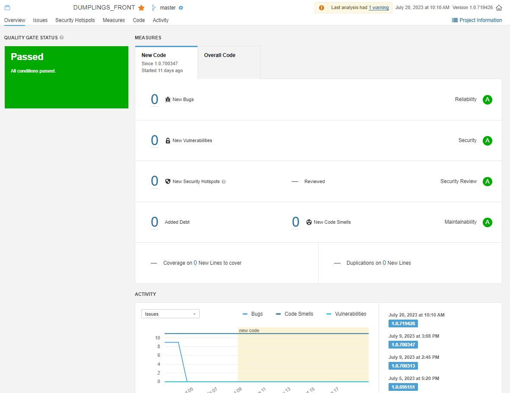
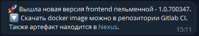
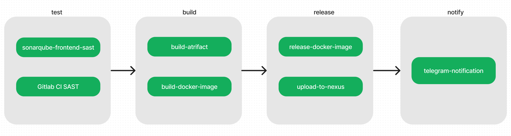
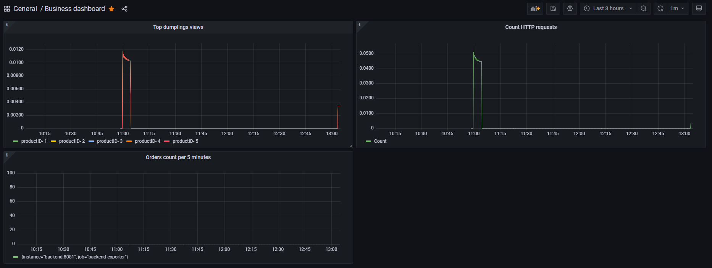
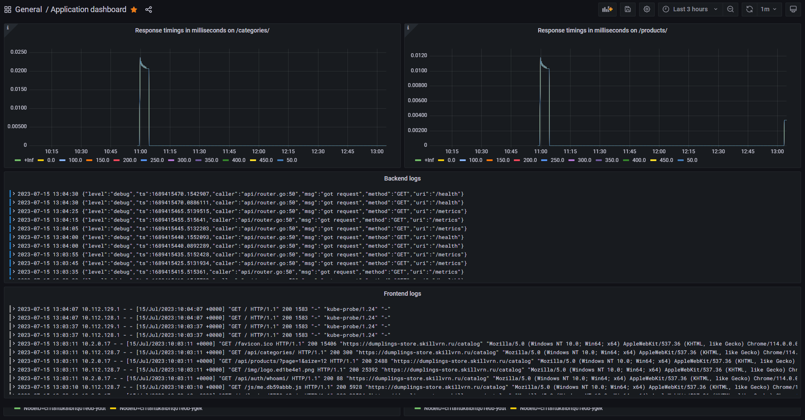
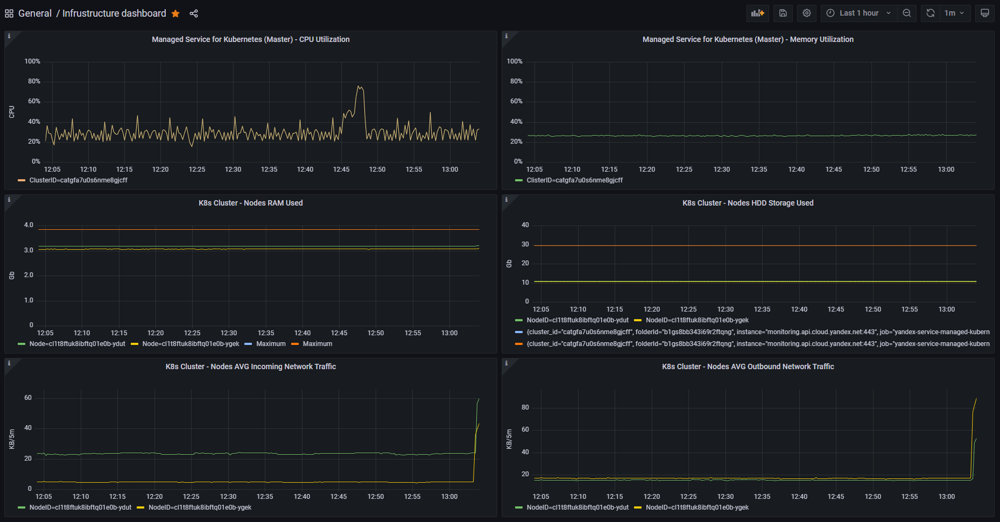

# Dumplings-Store - Пельменная №2



## Стек технологий

### Приложение

- **Работа с кодом**: Git
- **Frontend**: HTML, CSS, Vue, Ts, Js
- **Backend**: Go
- **Хранение медиа файлов**: S3
- **CI/CD**: Gitlab CI
- **Контейнеризация**: Docker
- **Тесты**: Unit, Gitlab SAST, SonarQube
- **Репозиторий**: Gitlab CI, Nexus
- **Уведомления**: Телеграм-бот

### Инфраструктура

- **Облако**: Яндекс.Облако
- **Контейнеризация**: Docker
- **Оркестратор**: Kubernetes
- **Инфраструктура**: Terraform, S3
- **Репозиторий**: Nexus
- **CI/CD**: Gitlab CI
- **Алертинг**: Телеграм-бот
- **Мониторинг**: Prometheus, Alertmanager, Loki, Grafana
- **Веб-сервер**: Ingress-controller, Network Load Balancer, Cert-manager, DNS, Nginx
- **Деплой**: Helm
- **Работа с кодом**: Git, Gitlab CI, IaC

## Зависимости

### Backend

| Элемент | Значение | 
|--------------|-----------|
| go | 1.17 |
| Docker image go | golang:1.17.13-alpine3.16 |
| Docker image release | scratch |

### Frontend

| Элемент | Значение | 
|--------------|-----------|
| axios | ^0.24.0 |
| cookie | ^0.4.1 |
| core-js | ^3.6.5 |
| svelte-debouncer | ^0.0.5 |
| vue | ^3.2.26 |
| vue-router | ^4.0.0-0 |
| vuex | ^4.0.2 |
| typescript | ~4.1.5 |
| webpack | ^4.39.3 |
| node | 6.9.0 |
| Docker image nginx | nginx:1.25.1 |
| Docker image node | node:16-alpine |

Подробнее в файле `package.json` и `package-lock.json`

## Каталог

```
.
├── .gitlab-ci.yml
├── backend
│   ├── .gitlab-ci.yml
│   ├── cmd
│   │   └── api
│   │       ├── app
│   │       │   ├── app.go
│   │       │   ├── app_test.go
│   │       │   ├── controller_auth.go
│   │       │   ├── controller_create_order.go
│   │       │   ├── controller_list_categories.go
│   │       │   ├── controller_list_dumplings.go
│   │       │   └── middleware.go
│   │       ├── dependencies
│   │       │   └── store.go
│   │       ├── main.go
│   │       └── router.go
│   ├── Dockerfile
│   ├── go.mod
│   ├── go.sum
│   └── internal
│       ├── logger
│       │   └── logger.go
│       └── store
│           └── dumplings
│               ├── fake
│               │   └── store.go
│               ├── mock
│               │   └── store.gen.go
│               ├── models.go
│               └── store.go
├── frontend
│   ├── .gitlab-ci.yml
│   ├── babel.config.js
│   ├── Dockerfile
│   ├── package.json
│   ├── package-lock.json
│   ├── public
│   │   ├── favicon.ico
│   │   ├── index.html
│   │   └── _redirects
│   ├── src
│   │   ├── App.vue
│   │   ├── assets
│   │   │   └── logo.png
│   │   ├── components
│   │   │   ├── cart
│   │   │   │   ├── CartTableRow.vue
│   │   │   │   └── CartTable.vue
│   │   │   ├── catalog
│   │   │   │   ├── CartCardRow.vue
│   │   │   │   ├── CartCard.vue
│   │   │   │   ├── Filters.vue
│   │   │   │   ├── Pagination.vue
│   │   │   │   ├── Products.vue
│   │   │   │   ├── Product.vue
│   │   │   │   └── Search.vue
│   │   │   ├── misc
│   │   │   │   ├── Alert.vue
│   │   │   │   ├── Center.vue
│   │   │   │   └── Spinner.vue
│   │   │   ├── navbar
│   │   │   │   ├── CartIcon.vue
│   │   │   │   ├── index.ts
│   │   │   │   └── Navbar.vue
│   │   │   └── profile
│   │   │       └── ChangePassword.vue
│   │   ├── main.ts
│   │   ├── models
│   │   │   ├── category.model.ts
│   │   │   ├── pagination.model.ts
│   │   │   └── product.model.ts
│   │   ├── router
│   │   │   └── index.ts
│   │   ├── services
│   │   │   ├── api.service.ts
│   │   │   └── resources
│   │   │       ├── base.service.ts
│   │   │       ├── categories.service.ts
│   │   │       ├── non_paginated.service.ts
│   │   │       ├── paginated.service.ts
│   │   │       └── products.service.ts
│   │   ├── shims-vue.d.ts
│   │   ├── shims-vuex.d.ts
│   │   ├── store
│   │   │   └── index.ts
│   │   ├── typings
│   │   │   └── index.ts
│   │   └── views
│   │       ├── 404.vue
│   │       ├── Cart.vue
│   │       ├── Catalog.vue
│   │       ├── Login.vue
│   │       └── Profile.vue
│   ├── tsconfig.json
│   └── vue.config.js
├── helm
│   ├── charts
│   │   ├── backend
│   │   │   ├── Chart.yaml
│   │   │   ├── templates
│   │   │   │   ├── deployment.yaml
│   │   │   │   ├── secrets.yaml
│   │   │   │   └── service.yaml
│   │   │   └── values.yaml
│   │   └── frontend
│   │       ├── Chart.yaml
│   │       ├── templates
│   │       │   ├── configmap.yaml
│   │       │   ├── deployment.yaml
│   │       │   ├── ingress.yaml
│   │       │   ├── secrets.yaml
│   │       │   └── service.yaml
│   │       └── values.yaml
│   ├── Chart.yaml
│   └── values.yaml
├── images
│   ├── app-screenshot.png
│   ├── pipe-line-backend.png
│   ├── pipe-line-frontend.png
│   ├── sonar-back.png
│   ├── sonar-front.png
│   ├── telegram-notification-02.png
│   └── telegram-notification-03.png
├── k8s-additional
│   ├── acme-issuer.yaml
│   └── sa.yaml
├── LICENSE
├── monitoring
│   ├── alertmanager
│   │   ├── Chart.yaml
│   │   ├── templates
│   │   │   ├── configmap.yaml
│   │   │   ├── deployment.yaml
│   │   │   ├── _helpers.tpl
│   │   │   ├── ingress.yaml
│   │   │   └── services.yaml
│   │   └── values.yaml
│   ├── grafana
│   │   ├── Chart.yaml
│   │   ├── dashboards
│   │   │   └── Kubernetes___Compute_Resources___Pod.json
│   │   ├── templates
│   │   │   ├── deployment.yaml
│   │   │   ├── _helpers.tpl
│   │   │   ├── ingress.yaml
│   │   │   ├── pvc.yaml
│   │   │   ├── pv.yaml
│   │   │   └── services.yaml
│   │   └── values.yaml
│   └── prometheus
│       ├── Chart.yaml
│       ├── rules
│       │   └── dumplings-store.yaml
│       ├── templates
│       │   ├── configmap.yaml
│       │   ├── deployment.yaml
│       │   ├── ingress.yaml
│       │   ├── rules.yaml
│       │   └── services.yaml
│       └── values.yaml
├── README.md
├── scripts
│   ├── acme-issuer.yaml
│   ├── get-kube-config.sh
│   └── sa.yaml
└── terraform
    ├── main.tf
    ├── modules
    │   ├── grafana-disk
    │   │   ├── main.tf
    │   │   ├── variables.tf
    │   │   └── versions.tf
    │   ├── k8s-cluster
    │   │   ├── main.tf
    │   │   ├── outputs.tf
    │   │   ├── variables.tf
    │   │   └── versions.tf
    │   ├── kms-key
    │   │   ├── main.tf
    │   │   ├── outputs.tf
    │   │   ├── variables.tf
    │   │   └── versions.tf
    │   ├── node-group
    │   │   ├── main.tf
    │   │   ├── variables.tf
    │   │   └── versions.tf
    │   ├── security-group
    │   │   ├── main.tf
    │   │   ├── outputs.tf
    │   │   ├── variables.tf
    │   │   └── versions.tf
    │   ├── service-account
    │   │   ├── main.tf
    │   │   ├── outputs.tf
    │   │   ├── variables.tf
    │   │   └── versions.tf
    │   ├── static-ip
    │   │   ├── main.tf
    │   │   ├── variables.tf
    │   │   └── versions.tf
    │   └── yc-network
    │       ├── main.tf
    │       ├── outputs.tf
    │       ├── variables.tf
    │       └── versions.tf
    ├── provider.tf
    ├── variables.tf
    └── versions.tf
```

## Описание основных каталогов и файлов в репозитории

- `.gitlab-ci.yml` - конфигурация пайплайна
- `backend` - каталог с исходниками backend'а приложения и CI/CD конфигурацией
- `backend/.gitlab-ci.yml` - конфигурация дочернего пайплайна для backend'а
- `backend/cmd` и `backend/src` - исходники приложения на Go
- `backend/Dockerfile` - конфигурация для сборки Docker image backend'а
- `backend/go.mod` и `backend/go.sum` - исходники приложения на Go
- `frontend` - каталог с исходниками frontend'а приложения и CI/CD конфигурацией
- `frontend/.gitlab-ci.yml` - конфигурация дочернего пайплайна для frontend'а
- `frontend/public` и `frontend/src` - исходники приложения на HTML, Vue, JS и TS
- `frontend/Dockerfile` - конфигурация для сборки Docker image frontend'а
- `helm` - Helm-чарты для деплоймента и обновления приложения
- `images` - для медиафайлов, использованных в README.md
- `k8s-additional/acme-issuer.yaml` - манифест для запуска Cert-manager в K8s кластере
- `k8s-additional/sa.yaml` - манифест для создания в кластере ServiceAccount для доступа к кластеру из CI/CD
- `monitoring` - Helm-чарты для запуска сервисов мониторинга
- `monitoring/alertmanager` - Helm-чарты для запуска Alertmanager в K8s кластере
- `monitoring/grafana` - Helm-чарты для запуска Grafana в K8s кластере
- `monitoring/prometheus` - Helm-чарты для запуска Prometheus в K8s кластере
- `scripts` - дополнительные скрипты
- `scripts/get-kube-config.sh` - скрипт, который генерирует конфигурационный файл для подключения и авторизации в K8s кластере
- `terraform` - спецификация для создания инфраструктуры в облаке
- `terraform/main.tf` - основной файл спецификации terraform'а
- `terraform/modules` - каталог с модулями тераформа
- `terraform/modules/grafana-disk` - создание в облаке диска для подключения к нему в Pod'е Grafana
- `terraform/modules/k8s-cluster` - создание K8s кластера
- `terraform/modules/kms-key` - создание KMS ключа шифрования
- `terraform/modules/node-group` - создание инстансов для кластера
- `terraform/modules/security-group` - определение сетевых правил для назначения Nodes-group
- `terraform/modules/service-account` - создание сервисного аккаунта для дальнешего управления объектами
- `terraform/modules/static-ip` - создание статического IP-адреса для Network Load Balancer
- `terraform/modules/yc-network` - создание сети и подсетей для K8s кластера

## Переменные CI/CD

### В проекте Gitlab CI:

| Элемент | Комментарий |
|--------------|-----------|
| `DOCKERHUB_PASS` | Пароль к учетной записи Docker Hub для скачивания образов (чтобы не было ошибок по лимитам на раннерах) |
| `DOCKERHUB_USER` | Учетная запись для Docker Hub |
| `DUMPLINGS_STORE_14_BACK_TOKEN` | Token проекта в SonarQube для тестирования backend'а |
| `DUMPLINGS_STORE_14_FRONT_TOKEN` | Token проекта в SonarQube для тестирования frontend'а |
| `NEXUS_REPO_PASSWORD` | Пароль учетной записи репозитория Nexus |
| `NEXUS_REPO_USER` | Имя пользователя учетной записи репозитория Nexus |
| `NEXUS_REPO_URL_BACKEND` |  URL репозитория Nexus для backend |
| `NEXUS_REPO_URL_FRONTEND` | URL репозитория Nexus для frontend |
| `SONAR_PROJECT_KEY_BACK` | Ключ-название, по которому определяется проект в SonarQube для backend'а |
| `SONAR_PROJECT_KEY_FRONT` | Ключ-название, по которому определяется проект в SonarQube для frontend'а |
| `SONAR_URL` | URL SonarQube сервиса |
| `TELEGRAM_BOT_TOKEN` | Token Telegram-Бота для уведомлений |

### В конфигурационных файлах пайплайна

| Элемент | Значение |
|--------------|-----------|
| `VERSION` | Глобальная переменная. Версия приложения, генерируется динамически |
| `BACKEND_ENV_NAME` | Название окружения для Rollback backend'а |
| `SAST_EXCLUDED_ANALYZERS` | Исключение из анализатора SAST gosec |
| `APP_NAME` | Название приложения |
| `BACK_ART_ADDRESS` | Формирование ссылки для загрузки артефакта backend'а в репозиторий |
| `FRONT_ENV_NAME` | Название окружения для Rollback frontend'а |
| `FRONT_ART_ADDRESS` | Формирование ссылки для загрузки артефакта frontend'а в репозиторий |

## Описание конвейера

Тригером к запуску пайплайна служат изменения, сделанные в каталогах backend или frontend.

### Стадии

- Тестирование
- Сборка
- Релиз (доставка)
- Уведомление

### Конвейер Backend'а

#### Тестирование

**Static application security testing (SAST)**

Тестируем приложение, анализируя исходный код программного обеспечения для выявления источников уязвимостей. Производится средствами Gitlab CI.

**Unit**

Запускаем написанные разработчиками тесты

**SonarQube**

Используется сторонее ПО для анализа исходного кода.



#### Сборка

Используем кеш. Будет выполнена только при успешном выполнении всех тестов.
Сборка делится на 2 этапа:

**Сборка артефакта**

Для того, чтобы получить бинарный файл, который можно будет в дальнейшем быстро использовать для тестов и экспериментов. Артефакт кладется в кеш и используется в следующей стадии.

**Сборка Docker-образа**

Используется технология Docker-in-Docker для создания Docker-image backend'а. Образ сразу же версионируется по SemVer и загружается в Docker Registry (Gitlab).

#### Релиз

Будет выполнена только при условии успешного выполнения предыдущего шага.
Состоит из двух частей:

**Доставка Docker image в репозиторий**

Скачиваем образ, который был получен из предыдущего шага, помечаем тегом `latest` и загружаем в репозиторий. Таким образом, у нас появляется/обновляется самый свежий образ приложения.

**Доставка артефакта в Nexus**

Подгружаем кеш, архивируем бинарник, версионируем и загружаем в Nexus-репозиторий.

#### Уведомление

Сработает только при успешном релизе.
Отправляем через Телеграм-бот уведомление об обновлении приложения:



#### Схема выполнения пайплайна



### Конвейер Frontend'а

#### Тестирование

**Static application security testing (SAST)**

Тестируем приложение, анализируя исходный код программного обеспечения для выявления источников уязвимостей. Производится средствами Gitlab CI.

**SonarQube**

Используется сторонее ПО для анализа исходного кода.



#### Сборка

Используем кеш. Будет выполнена только при успешном выполнении всех тестов.
Сборка делится на 2 этапа:

**Сборка артефакта**

Для того, чтобы получить исходники для веб-сервера, которые можно будет в дальнейшем быстро использовать для тестов и экспериментов. Артефакт кладется в кеш и используется в следующей стадии.

**Сборка Docker-образа**

Используется технология Docker-in-Docker для создания Docker-image frontend'а. Образ сразу же версионируется по SemVer и загружается в Docker Registry (Gitlab). Образ готовится на основе `nginx:1.25.1`.

#### Релиз

Будет выполнена только при условии успешного выполнения предыдущего шага.
Состоит из двух частей:

**Доставка Docker image в репозиторий**

Скачиваем образ, который был получен из предыдущего шага, помечаем тегом `latest` и загружаем в репозиторий. Таким образом, у нас появляется/обновляется самый свежий образ приложения.

**Доставка артефакта в Nexus**

Подгружаем кеш, архивируем бинарник, версионируем и загружаем в Nexus-репозиторий.

#### Уведомление

Сработает только при успешном релизе.
Отправляем через Телеграм-бот уведомление об обновлении приложения:



#### Схема выполнения пайплайна



## Правила версионирования

Приложение версионируется по [SemVer](https://semver.org/)

При мелких правках версия генерируется автоматически. Минорные и мажорные версии вносятся в ручную.

## Модель ветвления

Используется модель Feature Branch Workflow. Все изменения делаются в отдельных ветках, затем создается merge request, который должен пройти review всех заинтересованных служб. После подтверждения производится слияние с веткой main.

## Дополнительно

Медиафайлы приложения перенесены в S3. Ссылки в исходниках заменены на новый ресурс. Создание S3-хранилища описано ниже.

# Инфраструктура

## Зависимости

| Элемент | Значение | 
|--------------|-----------|
| terraform.required_providers | >= 0.94 |
| terraform.version | >= 1.4.0 |
| Yandex Cloud CLI | 0.108.1 |
| kubectl | v5.0.1 |
| helm | v3.12.0 |
| cert-manager | v1.12.0 |

## Создание инфраструктуры

### Подготовительные работы

- [Зарегистрировать аккаунт в Яндекс.Облаке](https://cloud.yandex.ru/docs/billing/quickstart/)
- [Создать каталог](https://cloud.yandex.ru/docs/resource-manager/operations/folder/create)
- [Создать сервисный аккаунт с правами `Editor` для управления ресурсами](https://cloud.yandex.ru/docs/iam/quickstart-sa#create-sa)
- [Создать статический ключ для сервисного аккаунта](https://cloud.yandex.ru/docs/iam/concepts/authorization/key)
- [Создать Object Storage S3 бакет для хранения состояния terraform](https://cloud.yandex.ru/docs/tutorials/infrastructure-management/terraform-state-storage)
- [Создать Object Storage S3 бакет для хранения медиа файлов приложения](https://cloud.yandex.ru/docs/storage/quickstart)

### Получение доступа к управлению через YC CLI

- [Установить YC](https://cloud.yandex.ru/docs/cli/quickstart)
- [По сгенерированному статическому ключу настроить доступ к своему каталогу в облаке](https://cloud.yandex.ru/docs/cli/quickstart)
- [Установить terraform](https://developer.hashicorp.com/terraform/tutorials/aws-get-started/install-cli)

Для безопасности, в работе использовался IAM_Token, который необходимо периодически обновлять и записывать в `terraform/terraform.tfvars` в формате:

`iam_token="..."`

*Файл добавлен в исключения в .gitignore*

### Создание инфраструктуры в автоматическом режиме

- Загрузите репозиторий

```
git clone git@github.com:skillvrn/web-store.git
```

- Перейти в директорию с тераформом

```
cd web-store/terraform
```

- По необходимости отредактировать переменные:

| Название переменной | Адрес файла | Значение по умолчанию | Назначение |
|--------------|-----------|------------|------------|
| `cloud_id` | `variables.tf` | `b1g1kocv9lk6m51luk8o` | ID облака в YC |
| `folder_id` | `variables.tf` | `b1gs8bb343i69r2ftqng` | ID каталога в YC |
| `zone` | `variables.tf` | `ru-central1-a` | Зона доступности для создания объектов |
| `ip_name` | `modules/static-ip/variables.tf` | `k8s-ip` | Название для статического IP адреса |
| `deletion_protection` | `modules/static-ip/variables.tf` | `true` | Флаг запрета на удаление статического IP-адреса |
| `vpc_subnet_zone` | `modules/yc-network/variables.tf` | `ru-central1-a` | Зона доступности для создания сети и подсетей |
| `yc_network_name` | `modules/yc-network/variables.tf` | `k8s-net` | Имя для сети |
| `subnet` | `modules/yc-network/variables.tf` | `10.2.0.0/16` | Идентификатор и CIDR подсети для кластера |
| `disk_name` | `modules/grafana-disk/variables.tf` | `disk_name` | Название диска для подключения к Grafana Pod |
| `disk_type` | `modules/grafana-disk/variables.tf` | `network-hdd` | Тип диска, который будет создан |
| `disk_size` | `modules/grafana-disk/variables.tf` | `1` | Размер диска в Гигабайтах |
| `disk_image_id` | `modules/grafana-disk/variables.tf` | `fd8s0rs9nmtku47an507` | Образ диска с полностью готовой конфигурацией Grafana |
| `sa_name` | `modules/service-account/values.tf` | `k8s-account` | Название для сервисного аккаунта |
| `security_group_name` | `modules/security-group/values.tf` | `k8s-public-services` | Название для политики безопасности |
| `kms_key_name` | `modules/kms-key/values.tf` | `kms_key_name` | Название для ключа авторизации |
| `k8s_version` | `modules/k8s-cluster/values.tf` | `1.24` | Версия Kubernetes |
| `nodes_name` | `modules/node-group/values.tf` | `k8s-nodes` | Название для группы инстансов кластера |
| `platform_id` | `modules/node-group/values.tf` | `standard-v1` | Идентификатор платформы для node-group |
| `runtime_type` | `modules/node-group/values.tf` | `containerd` | Тип runtime платформы для Nodes |
| `disk_type` | `modules/node-group/values.tf` | `network-hdd` | Тип дисковой системы для использования на Nodes |
| `disk_size` | `modules/node-group/values.tf` | `30` | Размер дисков на Node'ах в Гигабайтах |
| `resources_cores` | `modules/node-group/values.tf` | `2` | Количество ядер CPU для Nodes |
| `resources_memory` | `modules/node-group/values.tf` | `4` | Объем оперативной памяти на Nodes |
| `preemptible` | `modules/node-group/values.tf` | `true` | Флаг, отвечающий за тип ВМ по режиму работы (прерываемая или нет) |
| `nat` | `modules/node-group/values.tf` | `true` | Флаг, указывающий, будут ли ВМ для нужд кластера получать доступ в Интернет |

- Создайте новый token для доступа к облаку тераформом

```
IAM_TOKEN=`yc iam create-token`
```

- Запишите полученный ключ в переменную для доступа terraform к облаку:

```
 touch ./terraform.tfvars
 echo $IAM_TOKEN > ./terraform.tfvars
```

- Прописать доступ к S3 для хранения состояния teraform

В каталоге `terraform/` необходимо создать файл `config.s3.tfbackend` и в него записать данные для доступа к бакету тераформом в формате:

```
access_key="************"
secret_key="************"
```

- Выполните:

```
terraform init
terraform apply -auto-approve
```

При этом будут созданы следующие объекты:

1. Статический IP-адрес (в спецификации указано, что данный объект удалять нельзя - сделано, чтобы не править DNS-записи). Если запускаем не впервые, то новый IP создан не будет.
2. Сеть и подсети для master и worker Nodes
3. Диск на основе сохраненного образа с готовым конфигом и дашбордами для монтирования его к поду Grafana через Persistent Volume
4. Сервисный аккаунт с необходимыми правами для работы с кластером
5. Политику сетевых правил, разрешающей подключение к сервисам из интернета и наоборот
6. Ключ шифрования Yandex Key Management Service для шифрования важной информации
7. Кластер Managed Service for Kubernetes
8. Виртуальные машины для K8s кластера
9. Файл состояния тераформа в S3

При создании кластера назначается группа безопасности, а также сервисный аккаунт для управления кластером и нодами.

После создания каждого объекта терраформ делает вывод необходимых данных для передачи в смежные модули. Все зависимости описаны в корневой спецификации main.tf.
Примерное время выполнения - 10 минут.

### Создание доступа в кластер для CI/CD

- Вернитесь в корень репозитория

```
cd ../
```

- Выведите список кластеров облака:

```
yc managed-kubernetes cluster list
```

- Создайте конфигурацию для внешнего подключения к кластеру:

```
yc managed-kubernetes cluster get-credentials <cluster_id> --external --kubeconfig ./.kube/config
```

- [Установите kubectl](https://kubernetes.io/ru/docs/tasks/tools/install-kubectl/)
- Создайте в кластере 3 объекта (ClusterRoleBinding, Secret и ServiceAccount) при помощи подготовленного манифеста:

```
kubectl create -f k8s-additional/sa.yaml
```

Это необходимо для взаимодействия с API Kubernetes внутри кластера Kubernetes.

- Сгенерируйте сертификат и конфигурационный файл для их дальнейшего использования в CI/CD при помощи подготовленного скрипта.

*Примечание: в скрипте используется утилита [jq](https://jqlang.github.io/jq/) для выделения нужной информации из json, поэтому проверьте, что она установлена*

```
./scripts/get-kube-config.sh
```

В результате буду созданы 2 файла `kubeconfig` и `ca.pem`.

- Теперь необходимо содержание данных файлов закодировать в base64 и создать в качестве переменных Gitlab CI, в проекте для CI/CD:

```
cat ./kubeconfig | base64
```

Данный вывод сохраните в переменную `KUBE_CONFIG` в проекте Gitbal CI.

```
cat ./ca.pem | base64
```

Данный вывод сохраните в переменную `CLUSTER_CERT` в проекте Gitbal CI.

- Удалите локальные файлы для исключения утечки секретной информации:

```
rm ./kubeconfig
rm ./ca.pem
```

### DNS

Прописать NS-записи (примеры):

| Имя | Тип | Значение |
|--------------|-----------|-----------|
| `web-store-fqdn.ru.` | `A` | `Static_IP` |
| `prometheus-fqdn.ru.` | `A` | `Static_IP` |
| `alertmanager-fqdn.ru.` | `A` | `Static_IP` |
| `grafana-fqdn.ru.` | `A` | `Static_IP` |

## Установка сервисов

### Подготовительные работы

- Создать namespace в кластере

```
kubectl create namespace dumplings-store
```

- Определить в конфигурации namespace по умолчанию:

```
kubectl config set-context --current --namespace=dumplings-store
```

- [Установить Helm](https://helm.sh/ru/docs/intro/install/)
- Добавить репозитории на локальной машине

```
helm repo add ingress-nginx https://kubernetes.github.io/ingress-nginx
helm repo add jetstack https://charts.jetstack.io
helm repo update
```

### Ingress

- Установить Ingress-controller

```
helm upgrade --install ingress-nginx ingress-nginx/ingress-nginx --namespace dumplings-store --set controller.service.loadBalancerIP=Static_IP
```

*Примечание 1: Static_IP - это статический IP адрес, полученный при создании объекта тераформом - при необходимости заменить*

*Примечание 2: После выполнения команды в облаке будет создан Network Load Balancer*

### Менеджер SSL-сертификатов

- Установить менеджер сертификатов для их автоматического получения при создании сервисов

```
helm upgrade --install cert-manager jetstack/cert-manager --namespace dumplings-store --version v1.12.0 --set installCRDs=true
```

*Примечание: --set installCRDs=true говорит, что нужно автоматически установить дополнительные типы ресурсов в кластер, иначе придётся это делать руками*

- В кластере объявите ресурс центра сертификации. Для этого используйте подготовленный манифест `k8s-additional/acme-issuer.yaml`. Обратите внимание, что внутри есть важные переменные, которые можно изменить:

| Элемент | Значение | 
|--------------|-----------|
| `name` | `letsencrypt` |
| `namespace` | `dumplings-store` |
| `spec.acme.server` | `https://acme-v02.api.letsencrypt.org/directory` |
| `spec.acme.email` | `someaddress@domain.ru` |

*Примечание: spec.acme.server можно изменить на тестовый ресурс https://acme-staging-v02.api.letsencrypt.org/directory, если нам нужно произвести тестирования наших сервисов. Почитать про ограничения можно [тут](https://support.cloudways.com/en/articles/5129566-let-s-encrypt-ssl-certificates-limitations)*

```
kubectl apply -f k8s-additional/acme-issuer.yaml
```

## Деплой приложения

В обычном режиме приложение устанавливается или обновляется автоматически через CI/CD. Для этого создана конфигурация `helm/.gitlab-ci.yaml`.

Переменные, которые можно/необходимо менять:

| Элемент | Значение | Комментарий |
|--------------|-----------|-----------|
| `VERSION` | `SemVer` | Версия сборки. Генерируется автоматически. Минорные и мажорные версии меняются вручную в глобальном конфиге CI/CD |
| `ENV_NAME` | `production` | Название окружения для RollBack в Gitlab CI |
| `APPLICATION` | `dumplings-store` | Название приложения. Влияет на название деплоймента в Helm |
| `CLUSTER_NAMESPACE` | `dumplings-store` | Название пространства имен в кластере K8s |

Переменные в проекте Gitlab CI, которые можно или нужно менять:

| Элемент | Значение | Комментарий |
|--------------|-----------|-----------|
| `CLUSTER_CERT` | Сертификат для проверки подлинности K8s Cluster в base64 (сменить, если другой кластер) |
| `DOCKER_CONFJSON` | Конфигурация для подключения к Docker репозиторию в base64 |
| `IMAGES_REPO_URL` | URL репозитория приложения с Docker-образами |
| `KUBE_CONFIG` | Конфигурация для подключения к K8s Cluster |
| `NEXUS_REPO_PASSWORD` | Пароль для доступа к Nexus репозиторию |
| `NEXUS_REPO_URL_HELM` | URL репозитория Helm-chart'ов деплоя приложения |
| `NEXUS_REPO_USER` | Имя пользователя для доступа к Nexus репозиторию |
| `STATIC_IP` | Статический IP адрес Network Load Balancer'а (из terraform) |
| `TELEGRAM_BOT_TOKEN` | Token Телеграм-бота для уведомлений о событиях в CI/CD |

**Стадии CI/CD**

- Релиз
    + Helm-chart'ы упаковываются
    + Помечаются версией в имени архива
    + Загружаются в Nexus-репозиторий

- Деплоймент
    + Формируются переменные с секретами
    + Настраивается окружение для доступа к кластеру и репозиторию
    + При помощи helm производится установка (обновление)

- Оповещение
    + Телеграм Бот присылает уведомление об обновлении приложения

**Helm chart'ы приложения**

Глобальные переменные:

| Элемент | Значение | Комментарии |
|--------------|-----------|-----------|
| `namespace` | `dumplings-store` | Используется единый namespace |
| `imagePullPolicy` | `Always` | Всегда скачивать Docker образы |
| `revisionHistoryLimit` | `15` | Сколько ревизий приложения будет хранить Helm |
| `strategyType` | `RollingUpdate` | Стратегия обновления |
| `partOf` | `dumplings-store` |  |
| `registryUrl` | `****` | Репозиторий Docker-образов |
| `dockerconfigjson` | `eyJhdXRoIjp7fX0=` | Заглушка, в которой нет чувствительных данных. Заменяется при деплое из переменной CI/CD |

Переменные для backend:

| Элемент | Значение | Комментарии |
|--------------|-----------|-----------|
| `image.repository` | `{{ .Values.global.registryUrl }}/dumplings-store-backend` | Формируется динамически |
| `image.tag` | `SemVer` | Версия Docker образа, который нужно указывать и менять при каждом обновлении приложения. Должно совпадать с dumplings-store-charts/Chart.yaml.dependencies.version backend |
| `dockerconfigjson` | `{{ .Values.global.dockerconfigjson }}` | Указывается при деплое, формируется динамически для создания Secret'а |
| `replicas` | `2` | Количество реплик подов |
| `maxUnavailable` | `1` | Максимальное количество подов, которые будут остановлены при обновлении |
| `service.port` | `8081` | Порт службы приложения внутри пода |

Переменные для frontend:

| Элемент | Значение | Комментарии |
|--------------|-----------|-----------|
| `image.repository` | `{{ .Values.global.registryUrl }}/dumplings-store-frontend` | Формируется динамически |
| `image.tag` | `SemVer` | Версия Docker образа, который нужно указывать и менять при каждом обновлении приложения. Должно совпадать с dumplings-store-charts/Chart.yaml.dependencies.version frontend |
| `dockerconfigjson` | `{{ .Values.global.dockerconfigjson }}` | Указывается при деплое, формируется динамически для создания Secret'а |
| `replicas` | `2` | Количество реплик подов |
| `service.port` | `8080` | Порт виртуального веб-сервера для фронтенда |
| `service.backendPort` | `8081` | Порт службы приложения внутри пода бекенда для связки (указывается в configmap) |
| `fqdn` | `dumplings-store.skillvrn.ru` | QFDN продакшен сайта |

**Backend Helm Chart Templates**

- Создается сервис
- Секрет с доступом в Docker-репозиторий
- Деплоймент

**Frontend Helm Chart Templates**

- Создается сервис
- Секрет с доступом в Docker-репозиторий
- Ingress для доступа к приложению по https

*Главное особенностью является указание директивы `spec.tls.secretName`, значение которой должно отличаться от других конфигураций Ingress в кластере, чтобы сертификаты от Let's Encrypt удачно создавались.*

- Configmap для деплоймента
- Деплоймент

## Мониторинг

### Prometheus

В Helm-чартах есть интеграция настройки получения метрик из Яндекс Облака по запущенным сервисам и созданным объектам. Для того, чтобы Prometheus собирал метрики, ему необходим доступ. Для это нужно создать отдельный сервисный аккаунт и назначить на него роль `monitoring.viewer`. После этого [создать ключ](https://cloud.yandex.ru/docs/iam/operations/api-key/create), который будет использоваться в качестве `bearer_token`.

Также в чартах есть переменные, которые можно изменить:

| Элемент | Значение | 
|--------------|-----------|
| `folderId` | `b1gs8bb343i69r2ftqng` |
| `bearerToken` | `token` |
| `namespace` | `dumplings-store` |
| `port` | `9090` |
| `selectorType` | `ClusterIP` |
| `fqdn` | `prometheus.skillvrn.ru` |
| `replicasCount` | `1` |
| `resourcesCPU` | `1` |
| `resourcesMem` | `1Gi` |

- Устанавливаем Prometheus:

```
export BEARER_TOKEN=<token>
helm upgrade --atomic --install --set bearerToken=$BEARER_TOKEN prometheus monitoring/prometheus
```

Система собирает следующие метрики:

1. Backend приложение (Endpoint: `backend:8081/metrics`)
2. Создаваемые службами Яндекс.Облака в каталоге через `monitoring.api.cloud.yandex.net`
3. Генерируемые службой Managed Service for Kubernetes через `monitoring.api.cloud.yandex.net`

### Alertmanager

Интегрируем при помощи Helm-чартов.

Для алертов используется заранее созданный telegram бот.

Переменные, которые можно изменить:

| Элемент | Значение | 
|--------------|-----------|
| `bot_token` | `token` |
| `chat_id` | `1236238897` |
| `namespace` | `dumplings-store` |
| `port` | `9093` |
| `selectorType` | `ClusterIP` |
| `fqdn` | `alertmanager.skillvrn.ru` |
| `resourcesCPU` | `0.5` |
| `resourcesMem` | `256Mi` |

- Установка:

```
export BOT_TOKEN=<bot_token>
helm upgrade --atomic --install --set bot_token=$BOT_TOKEN alertmanager monitoring/alertmanager
```

*Где `bot_token` - указание секрета для доступа к API Телеграм бота*

### Loki

Утилита для сбора логов.
Мы собираем логи из k8s кластера. Поэтому используем готовые Helm-чарты для этих нужд.

- Установка:

```
helm repo add grafana https://grafana.github.io/helm-charts
helm repo update
helm upgrade --atomic --install --set loki.persistence.enabled=true,loki.persistence.storageClassName=yc-network-hdd loki grafana/loki-stack
```

При создании сервиса в кластере также в облаке будет создан диск, а в кластере Persistent Volume (PV) и Persistent Volume Claim (PVC) для хранения полученных данных. PV подключается к диску автоматически. Но нужно учитывать, что <u>при удалении ресурса диск автоматически не удаляется</u>. Это нужно делать вручную!

### Grafana

Интегрируем при помощи Helm чарта.

Переменные, которые можно изменить:

| Элемент | Значение |
|--------------|-----------|
| `namespace` | `dumplings-store` |
| `port` | `3000` |
| `selectorType` | `ClusterIP` |
| `fqdn` | `grafana.skillvrn.ru` |
| `resourceStorage` | `1Gi` |
| `csiDriver` | `disk-csi-driver.mks.ycloud.io` |
| `csiFsType` | `ext4` |
| `grafanaDiskId` | `fhm886i2faug718ddf3g` |
| `storageClassName` | `yc-network-hdd` |
| `imagePullPolicy` | `IfNotPresent` |
| `resourcesCPU` | `250m` |
| `resourcesMem` | `750Mi` |

*Внимание! Размер диска (параметр resourceStorage должен быть не больше, чем размер диска, создаваемого тераформом), а тип диска должен соответствовать.*

*Примечание: в случае пересоздания инфраструктуры необходимо заменить идентификатор диска (`grafanaDiskId`), который был создан тераформом!*

- Установка:

```
helm upgrade --atomic --install grafana monitoring/grafana
```

При создании сервиса в K8s кластере будут созданы Persistent Volume (PV) и Persistent Volume Claim (PVC) для хранения полученных данных. PV создается с подключением к существующему диску. За счет этого мы не теряем конфигурацию Графаны, а также доступы и дашборды.

В графане представлены 3 дашборда:

- Business Dashboard



Показывается:

1. Топ просмотров товаров
2. Количество HTTP-запросов за 5 минут
3. Количество заказов за 5 минут

- Application Dashboard



Показывается:

1. Время ответа страницы /categories/
2. Время ответа страницы /products/
3. Логи приложения с back- и frontend'а

- Infrastructure Dashboard



Показывается:

1. Загрузка CPU Master Node K8s Cluster'а
2. Загрузка оперативной памяти Master Node K8s Cluster'а
3. Загрузка оперативной памяти Worker Nodes K8s Cluster'а
4. Занятое место на жестких дисках Worker Nodes K8s Cluster'а
5. Загрузка сетевого интерфейса на нодах (входящий и исходящий трафик)

### Правила изменений и версионирования

1. Все изменения необходимо делать не в ветке `main` (применяется модель ветвления Feature Branch Workflow).
2. После завершения работы с изменениями необходимо делать merge request и проводить review кода. После подтверждения всеми службами производить слияние и применять изменения в инфраструктуру.
3. Версионирование осуществляется по [SemVer](https://semver.org/) и применяется для Helm-чартов.
4. При изменениях необходимо менять версии. Ниже представлена общая таблица всех объектов, где применяется версия:

| Объект | Файл | Название переменной |
|--------------|-----------|-----------|
| Версия шаблона Helm Chart Backend | `dumplings-store-charts/charts/backend/Chart.yaml` | `version` |
| Версия backend для отображения в деплойменте Helm (helm list) | `dumplings-store-charts/charts/backend/Chart.yaml` | `appVersion` |
| Версия backend для скачивания нужного образа из репозитория | `dumplings-store-charts/charts/backend/values.yaml` | `backend.image.tag` |
| Версия шаблона Helm Chart frontend | `dumplings-store-charts/charts/frontend/Chart.yaml` | `version` |
| Версия frontend для отображения в деплойменте Helm (helm list) | `dumplings-store-charts/charts/frontend/Chart.yaml` | `appVersion` |
| Версия backend для скачивания нужного образа из репозитория | `dumplings-store-charts/charts/frontend/values.yaml` | `frontend.image.tag` |
| Глобальная версия Helm Chart приложения | `dumplings-store-charts/charts/Chart.yaml` | `version` |
| Версия Helm Chart Prometheus | `monitoring/prometheus/Chart.yaml` | `version` |
| Версия Helm Chart Alertmanager | `monitoring/alertmanager/Chart.yaml` | `version` |
| Версия Helm Chart Grafana | `monitoring/grafana/Chart.yaml` | `version` |

## Удаление инфраструктуры

```
terraform destroy -auto-approve
```
